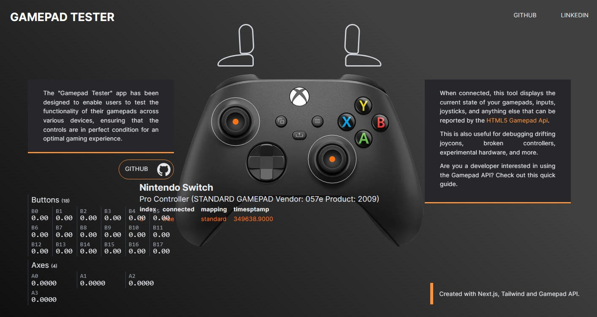

# Gamepad Tester

The "Gamepad Tester" is an application designed to verify and test the functionality of gamepads across different operating systems. It provides a simple and intuitive interface to check if gamepads are functioning correctly, ensuring all buttons and axes are responsive as expected.

<p align="center">
  
</p>


## Technologies Used

This project was created using the following technologies:

- [Tailwind CSS](https://tailwindcss.com/) for styling.
- [Next.js](https://nextjs.org/) for building React applications with server-side rendering.
- The [Gamepad API](https://developer.mozilla.org/en-US/docs/Web/API/Gamepad_API) for interacting with gamepad devices.

## How It Works

The recognition of the gamepad is achieved through the following code snippet:

```javascript
window.addEventListener("gamepadconnected", (event) => {
  // All buttons and axes values can be accessed through
  const gamepad = event.gamepad;
});
```
Additionally, there is a loop using setInterval to continuously listen for button actions:

```javascript

setInterval(() => {
  setGamepadInstance(
    navigator.getGamepads()[gamepad.index]
  );
}, 15);
```
---
Feel free to fork and use as you want.